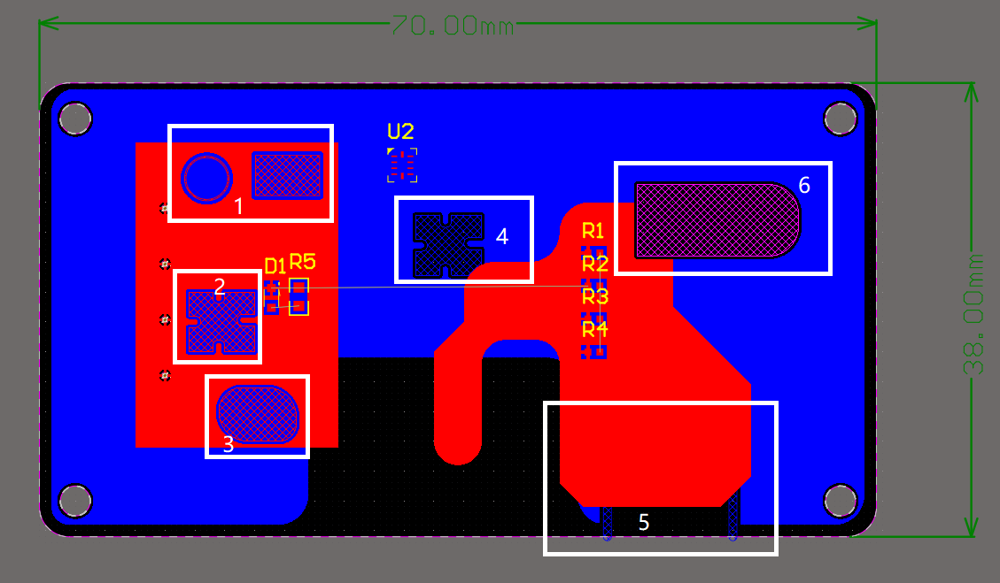

# Altium—Keepout与Mechanical层专题

Hi，大家好，今天的专题跟大家分享Altium的Keepout与Mechanical层的使用。

在我刚入门Altium到我画了几年电路图的过程中，我在使用Keepout（禁止布线层）层和Mechanical（机械层）的遇到了挺多的问题。这些问题通常是因为没有规范的使用这两种类型的的层叠结构导致的。后来通过学习Altium 官方的实例，并且自己不断在工程中总结，才深刻体会到自己过去对这个工具使用的错误或者说是不够标准的用法。


## 简介

首先，我们在打开的项目中，PCB编辑器中，按下字母键“L”,弹出“View Configuration”。在这里可以看到现在打开的PCB编辑器的所有层。


这些层分为四大类：

1. 信号和（电源）平面层：这是PCB电路板中具有电气特性的层。我们常说的电路板的层数就是指这类层的数量。**（这节不讲） **
2. 元器件组成层叠对：这是元器件一些需要区分上下层方式时使用的层。比如三维模型层，元器件放在顶层时，通常自动对应到Top 3D Body层，放置到底层，则自动对应到Bot 3D Body层；还有丝印层，元器件放在顶层和底层是要区分的，也会自动有一对层叠出现。这些在我们设计元器件封装库时，需要区分上下层属性的层最好都是用层叠对来单独对应。**（这节不讲） **
3. 机械层： 这里放置板子的机械层参数，比如： 边框（板子的形状），尺寸标注，材料说明，层叠结构说明等。这个将在后面详细讲解。
4. 其它层：主要包括Drill Drawing 按X 、Y 轴的数值定位，画出的整块印制板所需钻孔的位置图；Drill Guide是钻孔引导层,PCB板上会显示设置的钻孔信息； 和关键的keepout层，俗称禁止布线层，用来设置电气边界。

## 机械层（Mechanical）使用说明

国内大多数厂家默认使用Mechanical 1 作为板子的外形定义层。 而且板子上如果有开槽，开孔，也需要将封闭的形状绘制在这一层。 当然，如果你的设计中，板子外形、开孔、开槽等不是使用的这个层，一定要在制板前提前跟厂家说明。

例如： 下面我们看下嘉立创的说明：

原文链接： [技术指导：AD17和 AD18的 Keep-Out和Mechanical 1正确用法！](https://www.jlc.com/portal/server_guide_4090.html)

> ```
> AD软件升级到AD17和 AD18后，个别客户用软件画板还在用Keep-Out层画外形或者机械孔（条形槽）。 
> 
> 当用是DXP10和AD14低版本中打开，会直接显示勾选了：“Keep-Out”选项，软件自动禁止您所绘的线，
> 会导致孔和槽漏做。其实用keep out层来做边框，做开孔就是不规范的，keepout应该是用来辅助禁止
> 覆铜禁止走线路的和设定规则的。
>  
> 建议  建议 建议一定要在Mechanical 1画板框线或螺丝孔形状
> 
> 还有点小技巧，Keep-Out层的线不能直接COPY到机械1层，如是直接COPY的默认还是勾选的，一定要单
> 一在机械1层去画才行。
> 当然了，如果您不想改文件，认为改动工作量大，坚持在Keep-Out层画板框线及螺丝孔，请您一定一定
> 自己生成GERBER文件投单。
> 
> AD17以上版本Keep-Out绘的元素漏做不接受反馈。
> ```

这里也就说明了，在新版本的AD中，已经对于使用**Keepout**做边框和开孔的做法是**极其不推荐**的。而且软件在强制用户更改掉这样的习惯。（当然如果你自己很熟练原来的使用方式，并且与板厂的交接都是使用自己生成的gerber文件，你可以依旧任性一下）。

这里我推荐使用**Mechanical 1**画板框线或螺丝孔形状，这个规则已经在逐渐变成大家的一个默认约定。

对于一些比较特殊的形状的板子，复杂且精度要求较高的外形我们通常由机械设计软件，如SolidWorks、AutoCAD、CREO等绘制，导出板子边框为dxf，dwg或者step (三维) 等格式，然后使用Altium的导入工具进行导入。（File---> Import--->  dxf/dwg)

另外，也可以使用系统自带的其他的机械层设置尺寸参数，层叠结构组成表等。

如：下图示例


注意，如果上面的四个圆孔需要开孔，一般默认使用和板子边框同层的图形绘制。上图示例是使用的Mechanical 1(机械层1) 。

上面这种画法，在AD的3D视图中，并没有开孔。


有时候我们可能为了在3D视图中看到开孔。可以在边框层绘制要开的槽或孔等封闭的图形，选中单个封闭图形使用Tools-Convert- Create BoardCutout from selected primitives 来实现。（注意一定要将封闭图形和板子边框使用同一个层，否则板厂有可能漏做）。


​                                                                                   设置板子开孔工具


​                                                                                       开孔后3D效果


## 禁止布线层（Keepout）使用说明

如果你依旧坚持在使用AD17版本之前的道路上，那你很可能还在**使用keepout作为边框**。这样你可以参考这篇文章：

[技术指导：keepout勾勾不能勾](https://www.jlc.com/portal/server_guide_4066.html)

但是在新版本中，我都**强烈不**推荐使用keepout来定义板框。

而KeepOut用来定义各种禁止布线区域，覆铜边缘，覆铜上内嵌一些特殊的图形符号等功能。

这个功能可以参考AD官方视频， [How to Create Complex Keepout Shapes]()

官方视频在YouTube发布，我这里直接搬运到了下面的链接。

[AD官方，演示Keepout功能](https://www.bilibili.com/video/BV1XK4y1m7vS/)

而我自己也录制了视频演示这些功能，欢迎参考下面的视频，如果这个视频对你有所帮助，希望能够收获你的一键三连，感谢！

【TODO】: 录制视频，演示Keepout功能----视频编辑完再补

说明，下面是视频中的部分操作的文图说明：

使用Keepout可以修改覆铜层的形状。在单独的信号层放置Keepout可以单独针对对这个特定的信号层使用，也可以在keepout层放置，这将针对所有的信号层进行控制。



图中，1,2,3是在TopLayer层的覆铜区域放置的禁止布线层，4,5是在Bottom Layer层的覆铜区域放置的禁止布线层，6是直接在Keepout层放置的禁止布线区域。

上面只是说明Keepout在这些层上的基础应用。你们可以发挥你的想象力绘制更复杂的图形,用来定义电路板的电气边界。

建议大家看完视频后，自己凭记忆再操作几遍，这时候可能会忘记一些操作。再看视频就会对自己单独操作时遗忘的操作记忆深刻。


