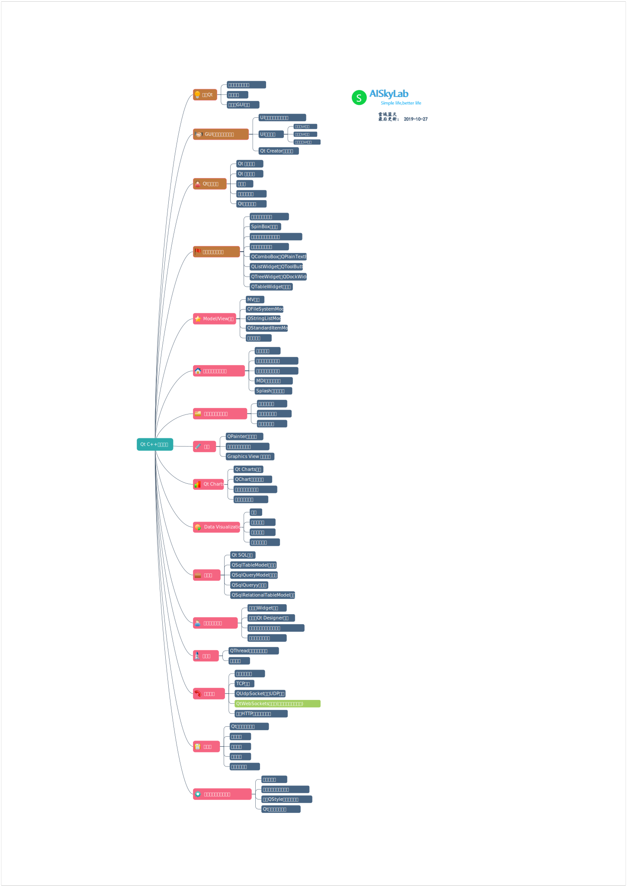

# Qt开发指南笔记整理

参考书籍：**《Qt5.9 C++开发指南》** 人民邮电出版社    王维波 栗宝娟 候春望.[著] 2018年5月第1版

## 目录  

### [第1章 认识Qt](ch1.md)

(2019-10-26)

### [第2章 GUI应用程序设计基础](ch2.md)

(2019-10-26)

### [第3章  Qt类库概述](ch3.md)

(2019-10-27)

### [第4章  常用界面设计组件](ch4.md)

(2019-10-27)

### [第5章  Model/View结构](ch5.md)

(2019-11-2)

### [第6章 对话框与多窗体设计](ch6.md)

(2019-11-3)

### [第7章 文件系统和文件读写](ch7.md)

(2019-11-6)

### [第8章 绘图](ch8.md)

(2019-11-6)

### [第9章 Qt Charts](ch9.md)

(2019-11-6)

### [第10章 Data Visualization](ch10.md)

(2019-11-7)

### [第11章 数据库](ch11.md)

(2019-11-7)

### [第15章 多媒体](ch15.md)

(2019-11-8)

## [第16章 应用程序设计辅助功能](ch16.md)

(2019-11-8)

## 学习思维导图

我将目录整理成学习的思维导图，更方便记忆和系统化整理知识。

## 补充学习资源

1. Qt官网： [Qt Documentation](https://doc.qt.io/qt-5/index.html#)
